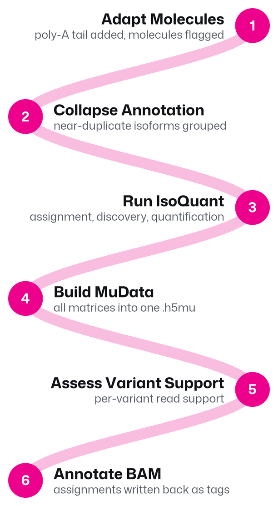

# Overview

The <b>BaseCode IsoQuant Pipeline</b> takes the
<b>BaseCode Synthetic Long Reads</b> produced by the
[BaseCode Processing Pipeline](overview.md) and performs isoform-level assignment,
transcript discovery and quantification against a reference annotation.

Isoform assignment and quantification are performed by
[IsoQuant](https://github.com/ablab/IsoQuant), which serves as the pipeline's analysis engine.
Basic Genomics maintains a dedicated build (`3.13.0.bg`) introducing a **BaseCode mode**,
which extends IsoQuant to account for the characteristics of reconstructed molecules. See
[why BaseCode data needs its own options](isoquant-input.md#basecode-options) for the
reasoning behind it and the settings it exposes.

## Main steps

The main steps of the BaseCode IsoQuant Pipeline. Hover over a numbered marker to read what
that step does.

1. **Adapt Molecules.** The stitched BAM is prepared for IsoQuant. Because the library preparation primes with poly-dT, a sequenced 3′ end is known with certainty, so those molecules receive a synthetic 24 bp soft-clipped poly-A tail for IsoQuant's poly-A logic. Every molecule is annotated with what was changed, and optionally only full-length molecules are kept.
2. **Collapse Annotation.** Reference annotations contain many transcripts that differ only marginally, most often in their UTR boundaries. Transcripts sharing the same body are grouped and one representative is kept, so molecules are not spread across near-identical entries. See [Annotation collapsing](isoquant-input.md#annotation-collapsing).
3. **Run IsoQuant.** Reads are assigned to isoforms, novel transcript models are constructed, and both reference and discovered transcripts and genes are quantified per sample, using the `SM` tag as the read group.
4. **Build MuData.** All count and TPM matrices are collected into a single `.h5mu` file for downstream analysis in Python. See [Output](isoquant-output.md).
5. **Assess Variant Support.** Per-variant read support is computed for discovered and/or reference transcripts.
6. **Annotate BAM.** The molecules are written back out as a BAM carrying their IsoQuant assignment in custom tags, so assignments can be inspected in a genome browser. Off by default; turn it on with `annotate_bam: True`. See [BAM file tags](isoquant-tags.md).

Docker is installed the same way as for the processing pipeline, see
[Preparation](preparation.md). The compute requirements are lower: this pipeline starts from a
single BAM rather than raw reads, so it needs considerably less CPU time and memory than a
full processing run. Allow disk space for the outputs, which can be large for deeply
sequenced runs.
