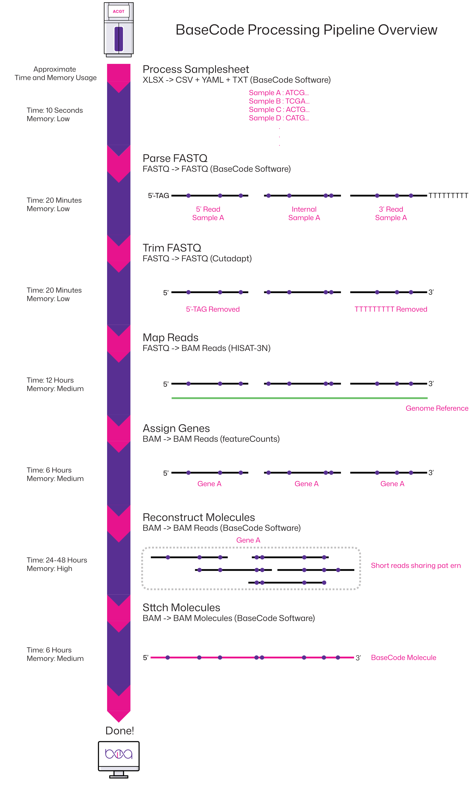

# Overview

## BaseCode Processing Pipeline
The main steps of the BaseCode Processing Pipeline:
1.	<b>Process Sample Sheet</b>

The specified sample sheet is analyzed together with the input FASTQ files to determine which samples are to be processed and their associated sample indexes.

2.	<b>Parse FASTQ</b>

The each read in the input FASTQ file is processed to determine read compartment (3', 5', or internal) and the sample of origin. Some trimming is performed.

3.	<b>Trim FASTQ</b>

The reads in the processed FASTQ file are further trimmed for adapter sequenced and other undesired sequences.

4.	<b>Map Reads</b>

The reads in the trimmed FASTQ file are mapped to the specified reference genome.

5.	<b>Assign Genes</b>

The mapped reads are assigned to a gene locus.

6.	<b>Reconstruct Molecules</b>

The mapped and gene assigned reads are analyzed and grouped based on their molecule-specific mismatch pattern.

7.	<b>Stitch Molecules</b>

Reads corresponding to the same molecules are combined to form a synthetic long read.

